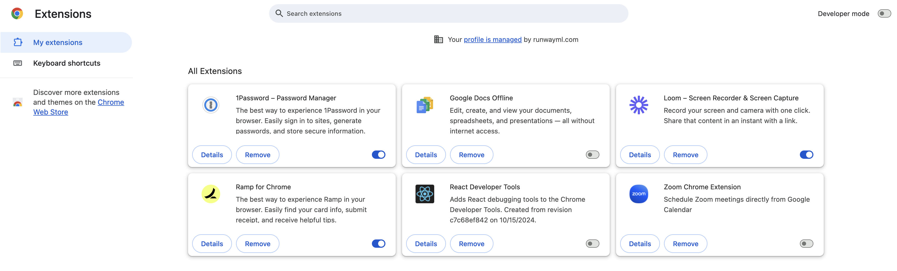
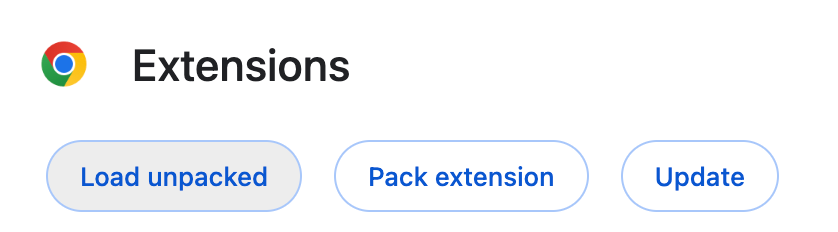
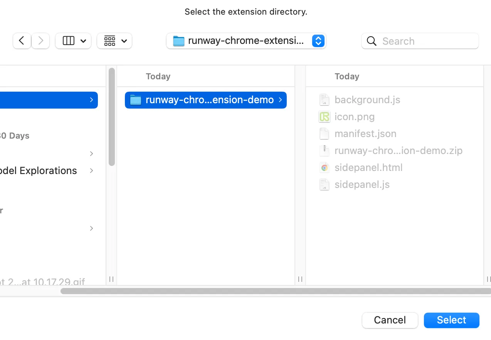
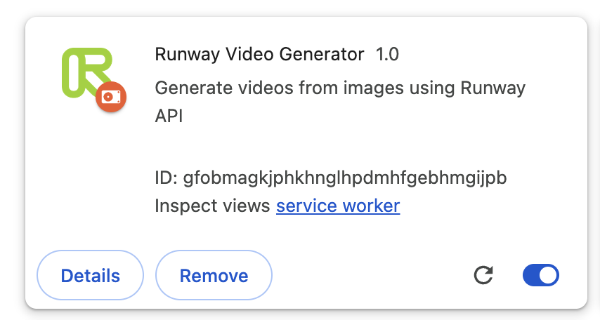

# Tutorial: Creating a Chrome Extension with Runway’s API

This tutorial walks you through creating a Chrome extension that lets you right click on any image on a website, and then sending it to Runway’s Gen-3 Alpha model to generate a 5 seconds long clip via our API. The extension will open a sidepanel to display progress, and show you completed generations.

If you just want to see source code of the completed extension, you can find it [here](./code).

## Step 0: Setting up your Runway API account.

To setup your Runway API account and create a key, follow the steps detailed [here](https://docs.dev.runwayml.com/guides/quickstart/). Once you have your key, save it in a safe place so that you can use it later.

## Step 1: Creating manifest.json

All chrome extensions require a manifest.json file that defines the extension’s capabilities and configuration. Our extension requires the following:

- background script,
- a sidepanel,
- adding an option to the context menu,
- reading the active tab to scan for images on the page,
- calling our api

Create a new file called `manifest.json` and copy and paste the following into the file:

```json
{
  "manifest_version": 3,
  "name": "Runway Video Generator",
  "version": "1.0",
  "description": "Generate videos from images using Runway API",
  "permissions": [
    "contextMenus",
    "storage",
    "sidePanel",
    "activeTab"
  ],
  "host_permissions": [
    "https://api.dev.runwayml.com/*"
  ],
  "background": {
    "service_worker": "background.js"
  },
  "action": {
    "default_title": "Open Runway Video Generator"
  },
  "side_panel": {
    "default_path": "sidepanel.html"
  },
  "icons": {
    "16": "icon.png",
    "48": "icon.png",
    "128": "icon.png"
  }
}
```

## Step 2: Creating the background script

Create a new file and name it `background.js` This file will hold logic that triggers when the Chrome extension is installed, and also whenever certain conditions are met, as we define it.

To add an option to the context menu (the menu you see when you right click on a web page), add the following function:

```jsx
chrome.runtime.onInstalled.addListener(() => { // triggered when the extension is installed
  chrome.contextMenus.create({
    id: "generateVideo",
    title: "Generate video with Runway",
    contexts: ["image"] // ensures that this is only added when you right click on an image
  });
});
```

Next, write the function that happens when you trigger this menu item:

```jsx
chrome.contextMenus.onClicked.addListener((info, tab) => {
  if (info.menuItemId === "generateVideo") {
    chrome.sidePanel.open({ windowId: tab.windowId });
    setTimeout(() => {
      // send a message to the side panel to start generating a video, sending the image's url to it
      chrome.runtime.sendMessage({ action: "generateVideo", imageUrl: info.srcUrl });
    }, 1000); // a timeout is necessary to give the side panel some time to open before it can start receiving events you send it.
  }
});
```

Since background scripts are the only place where we can call external APIs, we need to setup a listener to know when to call the generate endpoint, and to poll for a task’s status.

```jsx
chrome.runtime.onMessage.addListener((message, sender, sendResponse) => {
  if (message.action === "startVideoGeneration") {
    startVideoGeneration(message.imageUrl, message.apiKey)
      .then(taskId => sendResponse({ success: true, taskId }))
      .catch(error => sendResponse({ success: false, error: error.message }));
    return true;
  } else if (message.action === "pollForCompletion") {
    pollForCompletion(message.taskId, message.apiKey)
      .then(videoUrl => sendResponse({ success: true, videoUrl }))
      .catch(error => sendResponse({ success: false, error: error.message }));
    return true;
  }
});
```

You’ll see that there are 2 functions defined above. The first is `startVideoGeneration`, and the other one is `pollForCompletion`. You’ll also notice that the listener takes in `apiKey`. This will be sent by the sidePanel, which we will explain later.

`startVideoGeneration` calls the Runway API endpoint that sends an image URL to create what we call a `Task`. A `Task` has an unique `id`, that you can then use to check for the status. 

```jsx
async function startVideoGeneration(imageUrl, apiKey) {
  const response = await fetch("https://api.dev.runwayml.com/v1/image_to_video", {
    method: "POST",
    headers: {
      "Authorization": `Bearer ${apiKey}`,
      "X-Runway-Version": "2024-09-13",
      "Content-Type": "application/json",
    },
    body: JSON.stringify({
      "promptImage": imageUrl,
      "seed": Math.floor(Math.random() * 1000000000),
      "model": "gen3a_turbo",
      "promptText": "Generate a video",
      "watermark": false,
      "duration": 5,
      "ratio": "16:9"
    }),
  });

  const result = await response.json();
  if (!response.ok) {
    throw new Error(result.message || 'Failed to start video generation');
  }
  return result.id;
}
```

If a task was generated successfully, a task id is returned, and we send it back.

Since a task may take a while to complete, we need to set up a poll to continuously poll for its status.

```jsx
async function pollForCompletion(taskId, apiKey) {
  const response = await fetch(`https://api.dev.runwayml.com/v1/tasks/${taskId}`, {
    headers: {
      "Authorization": `Bearer ${apiKey}`,
      "X-Runway-Version": "2024-09-13",
    },
  });

  const result = await response.json();
  if (!response.ok) {
    throw new Error(result.message || 'Failed to check task status');
  }

  if (result.status === 'SUCCEEDED') {
    return result.output[0];
  } else if (result.status === 'FAILED') {
    throw new Error('Video generation failed');
  } else {
    throw new Error('still_processing');
  }
} 
```

You’ll notice that this code doesn’t actually contain the polling logic, but simply contains the fetch logic to check for the task’s status. The polling logic is contained in the sidepanel, which we will define next.

The completed `background.js` file should look like this:

```jsx
chrome.runtime.onInstalled.addListener(() => {
  chrome.contextMenus.create({
    id: "generateVideo",
    title: "Generate video with Runway",
    contexts: ["image"]
  });
});

chrome.contextMenus.onClicked.addListener((info, tab) => {
  if (info.menuItemId === "generateVideo") {
    chrome.sidePanel.open({ windowId: tab.windowId });
    setTimeout(() => {
      chrome.runtime.sendMessage({ action: "generateVideo", imageUrl: info.srcUrl });
    }, 1000);
  }
});

chrome.runtime.onMessage.addListener((message, sender, sendResponse) => {
  if (message.action === "startVideoGeneration") {
    startVideoGeneration(message.imageUrl, message.apiKey)
      .then(taskId => sendResponse({ success: true, taskId }))
      .catch(error => sendResponse({ success: false, error: error.message }));
    return true;
  } else if (message.action === "pollForCompletion") {
    pollForCompletion(message.taskId, message.apiKey)
      .then(videoUrl => sendResponse({ success: true, videoUrl }))
      .catch(error => sendResponse({ success: false, error: error.message }));
    return true;
  }
});

async function startVideoGeneration(imageUrl, apiKey) {
  const response = await fetch("https://api.dev.runwayml.com/v1/image_to_video", {
    method: "POST",
    headers: {
      "Authorization": `Bearer ${apiKey}`,
      "X-Runway-Version": "2024-09-13",
      "Content-Type": "application/json",
    },
    body: JSON.stringify({
      "promptImage": imageUrl,
      "seed": Math.floor(Math.random() * 1000000000),
      "model": "gen3a_turbo",
      "promptText": "Generate a video",
      "watermark": false,
      "duration": 5,
      "ratio": "16:9"
    }),
  });

  const result = await response.json();
  if (!response.ok) {
    throw new Error(result.message || 'Failed to start video generation');
  }
  return result.id;
}

async function pollForCompletion(taskId, apiKey) {
  const response = await fetch(`https://api.dev.runwayml.com/v1/tasks/${taskId}`, {
    headers: {
      "Authorization": `Bearer ${apiKey}`,
      "X-Runway-Version": "2024-09-13",
    },
  });

  const result = await response.json();
  if (!response.ok) {
    throw new Error(result.message || 'Failed to check task status');
  }

  if (result.status === 'SUCCEEDED') {
    return result.output[0];
  } else if (result.status === 'FAILED') {
    throw new Error('Video generation failed');
  } else {
    throw new Error('still_processing');
  }
}

```

## Step 3: Creating the sidepanel

The sidepanel consists of 2 files, the html file, and the javascript file that holds its logic. First, create a new file and name it `sidepanel.html`

```html
<!DOCTYPE html>
<html>
  <head>
    <title>Runway Video Generator</title>
    <style>
      body {
        font-family: Arial, sans-serif;
        padding: 20px;
      }
      #videoContainer {
        margin-top: 20px;
      }
      .video-wrapper {
        position: relative;
        margin-bottom: 20px;
        align-items: flex-end;
        display: flex;
        flex-direction: column;
      }
      video {
        max-width: 100%;
      }
      #apiKeyForm {
        margin-bottom: 20px;
      }
      #apiKey {
        width: 250px;
      }
      .remove-video {
        position: relative;
        background-color: #111;
        color: white;
        border: none;
        border-radius: 4px;
        width: 24px;
        height: 24px;
        font-size: 16px;
        margin-bottom: 2px;
        cursor: pointer;
        display: flex;
        align-items: center;
        justify-content: center;
      }
      .remove-video:hover {
        background-color: rgba(255, 0, 0, 1);
      }
    </style>
  </head>
  <body>
    <h1>Runway Video Generator</h1>
    <div id="apiKeyForm" style="display: none">
      <label for="apiKey">Enter your Runway API Key:</label>
      <input type="password" id="apiKey" required />
      <button id="saveApiKey">Save</button>
    </div>
    <div id="status">Waiting for image...</div>
    <div id="videoContainer"></div>
    <script src="sidepanel.js"></script>
  </body>
</html>
```

We have defined some css classes, as well as a form that asks the user for their API key. You will see this form for the API key only once — when you first invoke the side panel. 

> [!WARNING]  
> Never store API keys in source code. This is why we use the storage API and prompt the user to enter their API key in the side panel.

The API Key is then stored in Chrome’s local storage for the extension. It will be removed whenever the extension is uninstalled. 

Next, create a new file and name it `sidepanel.js`

```jsx
let apiKey = '';

function showApiKeyForm() {
  document.getElementById('apiKeyForm').style.display = 'block';
  document.getElementById('status').textContent = 'Please enter your Runway API Key to continue.';
}

function hideApiKeyForm() {
  document.getElementById('apiKeyForm').style.display = 'none';
}

document.getElementById('saveApiKey').addEventListener('click', () => {
  const inputApiKey = document.getElementById('apiKey').value.trim();
  if (inputApiKey) {
    chrome.storage.local.set({ apiKey: inputApiKey }, () => {
      apiKey = inputApiKey;
      hideApiKeyForm();
      document.getElementById('status').textContent = 'API Key saved. You can now generate videos.';
    });
  }
});

// Check for stored API key
chrome.storage.local.get("apiKey", (result) => {
  if (result.apiKey) {
    apiKey = result.apiKey;
    hideApiKeyForm();
  } else {
    showApiKeyForm();
  }
});

chrome.runtime.onMessage.addListener((message, sender, sendResponse) => {
  if (message.action === "generateVideo") {
    if (apiKey) {
      generateVideo(message.imageUrl);
    } else {
      showApiKeyForm();
    }
  }
});
```

The code above listens for the `generateVideo` event sent by `background.js` earlier, and then decide to either call a function called `generateVideo` or to show the api key form, depending if the user has already set the api key.

The following 2 functions sends events to `background.js` to call Runway’s API:

```jsx
async function generateVideo(imageUrl) {
  if (!apiKey) {
    showApiKeyForm();
    return;
  }

  const statusElement = document.getElementById('status');
  statusElement.textContent = 'Generating video...';

  try {
    const taskId = await startVideoGeneration(imageUrl);
    const videoUrl = await pollForCompletion(taskId);
    renderVideo(videoUrl);
    saveVideoData(imageUrl, videoUrl);
  } catch (error) {
    statusElement.textContent = `Error: ${error.message}`;
  }
}

async function startVideoGeneration(imageUrl) {
  return new Promise((resolve, reject) => {
    chrome.runtime.sendMessage({ action: "startVideoGeneration", imageUrl, apiKey }, (response) => {
      if (response.success) {
        resolve(response.taskId);
      } else {
        reject(new Error(response.error));
      }
    });
  });
}

async function pollForCompletion(taskId) {
  const statusElement = document.getElementById('status');
  
  while (true) {
    try {
      const videoUrl = await new Promise((resolve, reject) => {
        chrome.runtime.sendMessage({ action: "pollForCompletion", taskId, apiKey }, (response) => {
          if (response.success) {
            resolve(response.videoUrl);
          } else if (response.error === 'still_processing') {
            reject(new Error('still_processing'));
          } else {
            reject(new Error(response.error));
          }
        });
      });

      return videoUrl;
    } catch (error) {
      if (error.message === 'still_processing') {
        statusElement.textContent = 'Generating video... Please wait.';
        await new Promise(resolve => setTimeout(resolve, 2000));
      } else {
        throw error;
      }
    }
  }
}
```

Lastly, we’ll need to save, and render the videos:

```jsx
function renderVideo(videoUrl) {
  const statusElement = document.getElementById('status');
  statusElement.textContent = 'Video generated successfully!';

  const videoContainer = document.getElementById('videoContainer');
  const videoWrapper = document.createElement('div');
  videoWrapper.className = 'video-wrapper';
  videoWrapper.innerHTML = `
    <button class="remove-video" data-url="${videoUrl}">x</button>
    <video controls autoplay muted loop src="${videoUrl}"></video>
  `;
  videoContainer.insertBefore(videoWrapper, videoContainer.firstChild);

  // Add event listener to the new remove button
  videoWrapper.querySelector('.remove-video').addEventListener('click', removeVideo);
}

function saveVideoData(imageUrl, videoUrl) {
  chrome.storage.local.get('generatedVideos', (result) => {
    const videos = result.generatedVideos || [];
    videos.push({ imageUrl, videoUrl, timestamp: Date.now() });
    chrome.storage.local.set({ generatedVideos: videos });
  });
}

function removeVideo(event) {
  const videoUrl = event.target.getAttribute('data-url');
  const videoWrapper = event.target.closest('.video-wrapper');

  chrome.storage.local.get('generatedVideos', (result) => {
    let videos = result.generatedVideos || [];
    videos = videos.filter(video => video.videoUrl !== videoUrl);
    chrome.storage.local.set({ generatedVideos: videos }, () => {
      videoWrapper.remove();
    });
  });
}

// Load previously generated videos
function loadSavedVideos() {
  chrome.storage.local.get('generatedVideos', (result) => {
    const videos = result.generatedVideos || [];
    const videoContainer = document.getElementById('videoContainer');
    videoContainer.innerHTML = ''; // Clear existing videos

    videos.reverse().forEach(video => {
      const videoWrapper = document.createElement('div');
      videoWrapper.className = 'video-wrapper';
      videoWrapper.innerHTML = `
        <button class="remove-video" data-url="${video.videoUrl}">x</button>
        <video controls autoplay muted loop src="${video.videoUrl}"></video>
      `;
      videoContainer.appendChild(videoWrapper);

      // Add event listener to the remove
      videoWrapper.querySelector('.remove-video').addEventListener('click', removeVideo);
    });
  });
}
loadSavedVideos()
```

The completed `sidepanel.js` file should look like this:

```jsx
let apiKey = '';

function showApiKeyForm() {
  document.getElementById('apiKeyForm').style.display = 'block';
  document.getElementById('status').textContent = 'Please enter your Runway API Key to continue.';
}

function hideApiKeyForm() {
  document.getElementById('apiKeyForm').style.display = 'none';
}

document.getElementById('saveApiKey').addEventListener('click', () => {
  const inputApiKey = document.getElementById('apiKey').value.trim();
  if (inputApiKey) {
    chrome.storage.local.set({ apiKey: inputApiKey }, () => {
      apiKey = inputApiKey;
      hideApiKeyForm();
      document.getElementById('status').textContent = 'API Key saved. You can now generate videos.';
    });
  }
});

// Check for stored API key
chrome.storage.local.get("apiKey", (result) => {
  if (result.apiKey) {
    apiKey = result.apiKey;
    hideApiKeyForm();
  } else {
    showApiKeyForm();
  }
});

chrome.runtime.onMessage.addListener((message, sender, sendResponse) => {
  if (message.action === "generateVideo") {
    if (apiKey) {
      generateVideo(message.imageUrl);
    } else {
      showApiKeyForm();
    }
  }
});

async function generateVideo(imageUrl) {
  if (!apiKey) {
    showApiKeyForm();
    return;
  }

  const statusElement = document.getElementById('status');
  statusElement.textContent = 'Generating video...';

  try {
    const taskId = await startVideoGeneration(imageUrl);
    const videoUrl = await pollForCompletion(taskId);
    renderVideo(videoUrl);
    saveVideoData(imageUrl, videoUrl);
  } catch (error) {
    statusElement.textContent = `Error: ${error.message}`;
  }
}

async function startVideoGeneration(imageUrl) {
  return new Promise((resolve, reject) => {
    chrome.runtime.sendMessage({ action: "startVideoGeneration", imageUrl, apiKey }, (response) => {
      if (response.success) {
        resolve(response.taskId);
      } else {
        reject(new Error(response.error));
      }
    });
  });
}

async function pollForCompletion(taskId) {
  const statusElement = document.getElementById('status');
  
  while (true) {
    try {
      const videoUrl = await new Promise((resolve, reject) => {
        chrome.runtime.sendMessage({ action: "pollForCompletion", taskId, apiKey }, (response) => {
          if (response.success) {
            resolve(response.videoUrl);
          } else if (response.error === 'still_processing') {
            reject(new Error('still_processing'));
          } else {
            reject(new Error(response.error));
          }
        });
      });

      return videoUrl;
    } catch (error) {
      if (error.message === 'still_processing') {
        statusElement.textContent = 'Generating video... Please wait.';
        await new Promise(resolve => setTimeout(resolve, 2000));
      } else {
        throw error;
      }
    }
  }
}

function renderVideo(videoUrl) {
  const statusElement = document.getElementById('status');
  statusElement.textContent = 'Video generated successfully!';

  const videoContainer = document.getElementById('videoContainer');
  const videoWrapper = document.createElement('div');
  videoWrapper.className = 'video-wrapper';
  videoWrapper.innerHTML = `
    <button class="remove-video" data-url="${videoUrl}">x</button>
    <video controls autoplay muted loop src="${videoUrl}"></video>
  `;
  videoContainer.insertBefore(videoWrapper, videoContainer.firstChild);

  // Add event listener to the new remove button
  videoWrapper.querySelector('.remove-video').addEventListener('click', removeVideo);
}

function saveVideoData(imageUrl, videoUrl) {
  chrome.storage.local.get('generatedVideos', (result) => {
    const videos = result.generatedVideos || [];
    videos.push({ imageUrl, videoUrl, timestamp: Date.now() });
    chrome.storage.local.set({ generatedVideos: videos });
  });
}

function removeVideo(event) {
  const videoUrl = event.target.getAttribute('data-url');
  const videoWrapper = event.target.closest('.video-wrapper');

  chrome.storage.local.get('generatedVideos', (result) => {
    let videos = result.generatedVideos || [];
    videos = videos.filter(video => video.videoUrl !== videoUrl);
    chrome.storage.local.set({ generatedVideos: videos }, () => {
      videoWrapper.remove();
    });
  });
}

// Load previously generated videos
function loadSavedVideos() {
  chrome.storage.local.get('generatedVideos', (result) => {
    const videos = result.generatedVideos || [];
    const videoContainer = document.getElementById('videoContainer');
    videoContainer.innerHTML = ''; // Clear existing videos

    videos.reverse().forEach(video => {
      const videoWrapper = document.createElement('div');
      videoWrapper.className = 'video-wrapper';
      videoWrapper.innerHTML = `
        <button class="remove-video" data-url="${video.videoUrl}">x</button>
        <video controls autoplay muted loop src="${video.videoUrl}"></video>
      `;
      videoContainer.appendChild(videoWrapper);

      // Add event listener to the remove
      videoWrapper.querySelector('.remove-video').addEventListener('click', removeVideo);
    });
  });
}
loadSavedVideos()
```

## Step 3.5: Create an icon

Save this image as `icon.png` in the same folder.


## Step 4: Testing your extension

To test your extension, you’ll need to install it. To do that, go to `chrome://extensions/` by typing it in your address bar, and hitting enter. 

Then turn on Developer Mode by clicking the switch in the top right hand corner.



Once you’ve turned it on, you should see the “Load unpacked” option. 



Click on “Load unpacked”, and select the folder where you saved the code for your chrome extension:



If you followed the steps correctly, you should now see the Runway Video Generator extension.



Now, go to any webpage that has an image, right click on it, and click on “Generate video with Runway”

